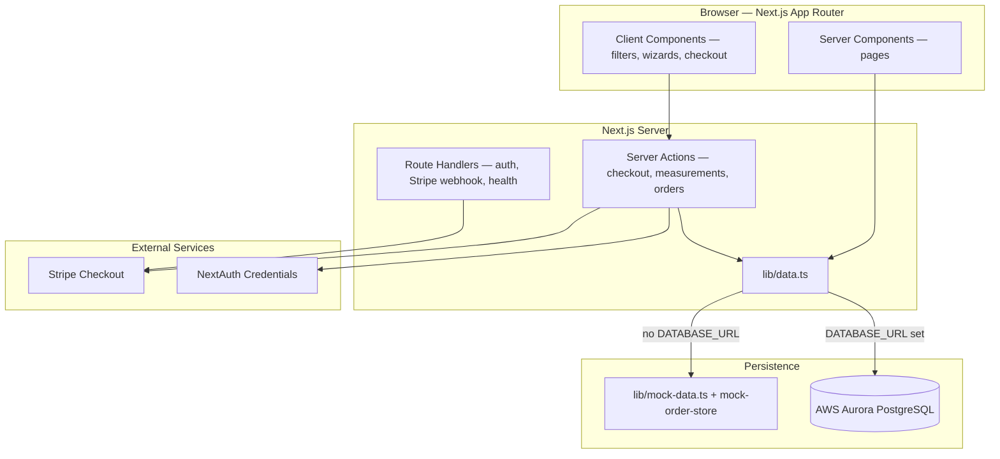
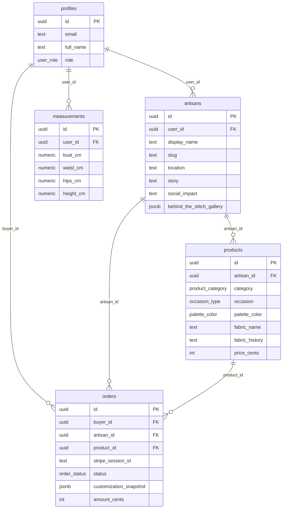
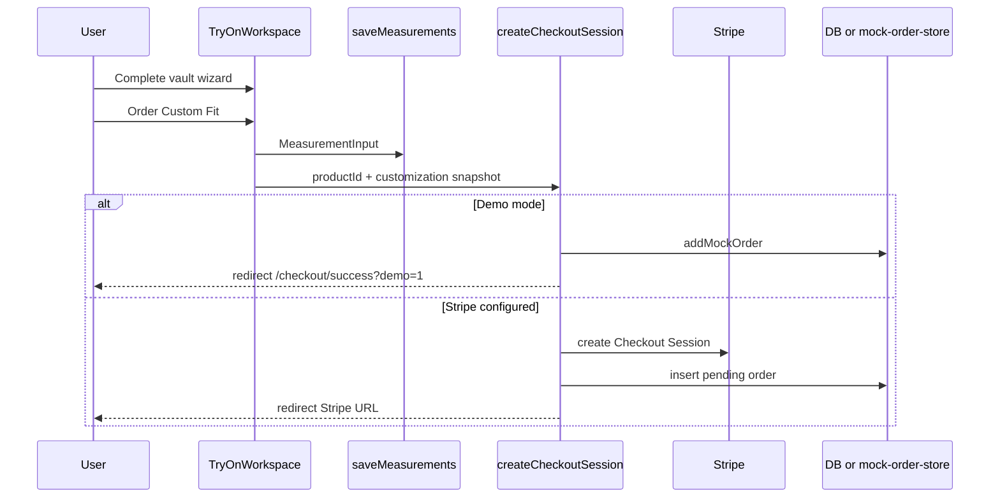

# Nyuzi — System Architecture & Database Design

Living reference for hackathon judges, future engineers, and production hardening.  
Updated to reflect the current codebase (editorial homepage, bags/accessories, try-on workspace, cultural filters).

---

## 1. Product overview

**Nyuzi** is a custom African fashion marketplace connecting global buyers with artisan makers. Buyers browse garments, bags, and accessories; customize fit or options; checkout via Stripe (or demo mode); artisans fulfill orders from a dashboard.

**Design philosophy:** Community-and-culture-first editorial UI (`bg-nyuzi-cream`, `text-nyuzi-ink`, Fraunces serif accents) — not a generic e-commerce grid.

---

## 2. High-level architecture



### Runtime modes

| Mode | Trigger | Behavior |
|------|---------|----------|
| **Demo / local** | `DATABASE_URL` unset | Mock catalog, in-memory orders, demo checkout |
| **Database** | `DATABASE_URL` set | Aurora reads/writes; mock fallback on query errors |
| **Payments** | `STRIPE_SECRET_KEY` unset | Demo checkout → mock order + success redirect |
| **Payments** | Stripe keys set | Real Checkout Session + webhook updates |

---

## 3. Tech stack

| Layer | Technology |
|-------|------------|
| Framework | Next.js 16 (App Router) |
| UI | React 19, Tailwind CSS 4 |
| Typography | Geist Sans, Geist Mono, Fraunces (display) |
| Database | PostgreSQL (AWS Aurora) |
| Payments | Stripe Checkout |
| Auth | NextAuth v4 (credentials provider, demo users) |
| Images | `next/image` + Unsplash remote patterns |

---

## 4. Application routes

| Route | Type | Purpose |
|-------|------|---------|
| `/` | Server | Editorial homepage — hero, pillars, artisan window, cultural protocol shop |
| `/try-on/[productId]` | Server + client | **Garments only** — dual-pane measurement vault + checkout |
| `/customize/[productId]` | Server + client | **Bags & accessories** — Ankara print / bead / brass options |
| `/artisan/[slug]` | Server | Documentary artisan journal + bespoke collection |
| `/artisan/dashboard` | Server | Artisan order list + status updates (protected) |
| `/account/orders` | Server | Buyer order history (protected) |
| `/login` | Server | Demo sign-in (buyer + 3 artisans) |
| `/checkout/success` | Server | Post-checkout confirmation |
| `/api/auth/[...nextauth]` | API | NextAuth handler |
| `/api/webhooks/stripe` | API | Stripe payment events |
| `/api/health` | API | Deploy health check |

**Middleware** (`middleware.ts`) protects `/account/orders` (buyer) and `/artisan/dashboard` (artisan).

---

## 5. Domain model

### 5.1 Product categories

```typescript
type ProductCategory = "garment" | "bag" | "accessory";
```

| Category | Customize flow | Checkout snapshot type |
|----------|----------------|------------------------|
| `garment` | `/try-on/[id]` — measurement vault wizard | `{ type: "garment", measurements }` |
| `bag` | `/customize/[id]` — size + Ankara print | `{ type: "bag", size, ankaraPrint }` |
| `accessory` | `/customize/[id]` — kind, size, beads/brass | `{ type: "accessory", kind, size, material, ... }` |

### 5.2 Occasions (cultural protocol filters)

```typescript
type OccasionType =
  | "traditional_wedding"
  | "formal_gala"
  | "celebration"
  | "casual_wear";
```

Homepage shop filters map to **cultural protocols**:

| Protocol | Occasions included |
|----------|-------------------|
| The Gathering (Galas & Weddings) | `formal_gala`, `traditional_wedding`, `celebration` |
| The Daily (Streetwear) | `casual_wear` |
| The Heritage (Ceremonies) | `traditional_wedding`, `celebration` |

### 5.3 Palette colors (app-layer only today)

Six culturally named colors for shop filtering. Stored on **`products.palette_color`** (`palette_color` enum) and mirrored in `types/palette.ts` for mock fallback via `resolveProductPalette()`.

| ID | Name | Hex |
|----|------|-----|
| `indigo_blue` | Indigo Blue | `#0F1E36` |
| `ochre_red` | Ochre Red | `#A84428` |
| `kente_gold` | Kente Gold | `#DCA134` |
| `mud_brown` | Mud Brown | `#3D2B20` |
| `emerald_green` | Emerald Green | `#1B4D3E` |
| `cowrie_cream` | Cowrie Cream | `#F9F6F0` |

### 5.4 Order customization snapshot

Stored in **`orders.customization_snapshot`** (JSONB):

```typescript
type CustomizationSnapshot =
  | {
      type: "garment";
      measurements: MeasurementInput;
      bodyBuild?: "slender" | "athletic" | "curvy";
      undertone?: number; // 1–5
      shoulder_cm?: number;
      sleeve_cm?: number;
      unit?: "cm" | "in";
    }
  | { type: "bag"; size: BagSize; ankaraPrint: AnkaraPrintId }
  | { type: "accessory"; kind; size; material; beadColor?; beadPattern?; brassStyle?; engraving? };
```

Legacy rows may use flat `MeasurementInput` (no `type`). Use `lib/format-customization.ts` for display.

**Upgrading old databases:** run `database/migrations/002_palette_social_impact_customization.sql` to add new columns and copy `measurement_snapshot` → `customization_snapshot`.

---

## 6. Database design

### 6.1 Entity relationship (logical)



### 6.2 Tables (see `database/schema.sql`)

| Table | Purpose |
|-------|---------|
| `profiles` | Users — buyer, artisan, or admin |
| `artisans` | Maker profiles linked 1:1 to a profile |
| `products` | Catalog items with category, fabric story, occasion |
| `measurements` | Saved buyer body measurements (garments) |
| `orders` | Paid/pending orders with JSONB customization snapshot |

### 6.3 Enums

| Enum | Values |
|------|--------|
| `user_role` | `buyer`, `artisan`, `admin` |
| `occasion_type` | `traditional_wedding`, `formal_gala`, `celebration`, `casual_wear` |
| `product_category` | `garment`, `bag`, `accessory` |
| `palette_color` | `indigo_blue`, `ochre_red`, `kente_gold`, `mud_brown`, `emerald_green`, `cowrie_cream` |
| `order_status` | `pending`, `paid`, `fulfilled`, `cancelled` |

### 6.4 Seed data

`database/seed.sql` — 3 artisans, 15 products (9 garments + 3 bags + 3 accessories), demo buyer profile.

Run order (fresh database):

```bash
psql "$DATABASE_URL" -f database/schema.sql
psql "$DATABASE_URL" -f database/seed.sql
```

Upgrading an existing Nyuzi database:

```bash
psql "$DATABASE_URL" -f database/migrations/002_palette_social_impact_customization.sql
```

### 6.5 Schema changelog

| Change | Status |
|--------|--------|
| `products.palette_color` enum + column | ✅ In `schema.sql` + seed |
| `artisans.social_impact` text | ✅ In `schema.sql` + seed |
| `orders.customization_snapshot` JSONB | ✅ Replaces legacy `measurement_snapshot` on fresh installs |
| Garment vault fields in checkout JSON | ✅ `bodyBuild`, `undertone`, `shoulder_cm`, `sleeve_cm`, `unit` |

---

## 7. Data access layer

**File:** `lib/data.ts`

| Function | Source |
|----------|--------|
| `getProducts(occasion?, category?)` | Products + artisan join |
| `getProduct(id)` | Single product |
| `getArtisans()` | All artisans |
| `getArtisan(slug \| id)` | Single artisan |
| `getArtisanProducts(artisanId)` | Products by maker |
| `getBuyerOrders(buyerId)` | Order history |
| `getArtisanOrders(artisanId)` | Dashboard orders |

**Mock fallback:** `lib/mock-data.ts`, `lib/mock-order-store.ts`

**Palette resolution:** `types/palette.ts` → `resolveProductPalette()`

---

## 8. Server actions & checkout flow



**Key files:**

- `lib/actions/checkout.ts` — `createCheckoutSession`
- `lib/actions/measurements.ts` — `saveMeasurements`
- `lib/actions/orders.ts` — `updateOrderStatus`
- `app/api/webhooks/stripe/route.ts` — payment confirmation

---

## 9. Authentication

**NextAuth credentials** (`lib/auth-options.ts`) with demo users:

| Role | Sign-in label |
|------|---------------|
| Buyer | Demo Buyer |
| Artisan | Amara Okafor, Zinhle Mthembu, Fatou Diallo |

Session exposes role for middleware and dashboard routing. Production: replace with Cognito or OAuth.

---

## 10. UI architecture (feature modules)

### Homepage (`app/page.tsx`)

Three narrative chapters + client shop shell (`HomePostHero`):

1. **Hero** — full-viewport cover, “Sculpt My Silhouette” CTA  
2. **Pillars of Craft** — Clothing / Bags / Bracelets → filters shop by category  
3. **Artisan Window** — fabric heritage split layout  
4. **Cultural Protocol Shop** — occasion + palette filters, editorial product list  

### Try-on workspace (`components/TryOnWorkspace.tsx`)

| Pane | Features |
|------|----------|
| **Left (sticky)** | Product image, Reveal Heritage toggle, melanin canvas silhouette |
| **Right (wizard)** | Steps 1–4: body build → undertone → metrics (in/cm) → vault secured |
| **Footer** | Order Custom Fit → existing checkout |

### Customize flow (`components/customize/`)

- `BagCustomizer` — size + Ankara print swatches  
- `AccessoryCustomizer` — bracelet/chain, beads/brass, engraving  
- `CustomizePanel` — preview + checkout  

### Artisan profile (`app/artisan/[slug]/page.tsx`)

Documentary journal layout — masthead, Behind the Stitch, bespoke collection grid.

---

## 11. Key file map

```
app/
  page.tsx                    # Editorial homepage
  try-on/[productId]/page.tsx # Garment workspace
  customize/[productId]/page.tsx
  artisan/[slug]/page.tsx
  artisan/dashboard/page.tsx
  account/orders/page.tsx

components/
  TryOnWorkspace.tsx          # Dual-pane vault + checkout
  home/                       # Homepage sections
  customize/                  # Bag & accessory UI

lib/
  data.ts                     # Data access + DB/mock fallback
  mock-data.ts                # Catalog seed
  mock-order-store.ts         # In-memory orders (demo)
  actions/checkout.ts
  actions/measurements.ts
  format-customization.ts     # Order snapshot display

types/
  database.ts                 # Core entities
  customization.ts            # Bag/accessory/garment snapshots
  palette.ts                  # Cultural color palette

database/
  schema.sql
  seed.sql
```

---

## 12. Environment variables

| Variable | Required | Purpose |
|----------|----------|---------|
| `DATABASE_URL` | No (demo) | Aurora PostgreSQL |
| `DATABASE_SSL` | If Aurora | SSL connection |
| `STRIPE_SECRET_KEY` | No (demo) | Real payments |
| `STRIPE_WEBHOOK_SECRET` | With Stripe | Webhook verification |
| `NEXT_PUBLIC_STRIPE_PUBLISHABLE_KEY` | With Stripe | Client Stripe |
| `NEXTAUTH_URL` | Production | Auth callback base |
| `NEXTAUTH_SECRET` | Production | Session signing |
| `NEXT_PUBLIC_APP_URL` | Production | Stripe redirect URLs |

See `.env.local.example` and `DEPLOY.md`.

---

## 13. Demo script (updated)

1. **Homepage** — Hero → Pillars (Clothing/Bags/Bracelets) → Artisan Window → filter by protocol + palette.  
2. **Garment** — open product → `/try-on/[id]` → complete 4-step vault → **Order Custom Fit**.  
3. **Bag or accessory** — `/customize/[id]` → choose options → checkout.  
4. **Artisan journal** — `/artisan/amara-okafor`.  
5. **Login** — Demo Buyer → **My orders**; sign in as artisan → **Dashboard** → mark fulfilled.

---

## 14. Maintaining this document

Update **ARCHITECTURE.md** when you:

- Add DB columns or enums  
- Change checkout/customization JSON shape  
- Add routes or auth providers  
- Move from mock-only to production services  

The root **README.md** stays a quick-start; this file is the system design reference.
