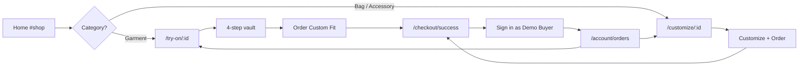

# Nyuzi

Custom African fashion marketplace — browse artisan garments, bags, and accessories; customize fit or heritage options; checkout via Stripe.

> **System architecture & database design:** see **[ARCHITECTURE.md](./ARCHITECTURE.md)** — routes, ER diagram, customization snapshots, mock vs Aurora modes, and UI module map.

## Quick start

```bash
npm install
npm run dev
```

Open [http://localhost:3001](http://localhost:3001) (`npm run dev` uses port **3001** — port 3000 may be used by other services on your machine).

No `.env.local` is required for local development. The app uses mock data from `lib/mock-data.ts` when `DATABASE_URL` is not set.

## User flows

Nyuzi routes shoppers by product category: **garments** use the virtual try-on workspace; **bags and accessories** use the customize workspace. Shared routing lives in `lib/product-routes.ts`.



### 1. Browse & shop

1. Open `/` and scroll to **Chapter III — The Shop** (`/#shop`), or use the hero **Shop the collection** link.
2. Filter by **Pillars of Craft** (Clothing / Bags / Bracelets), **cultural protocol**, and **palette color**.
3. Click a product card — routing is automatic:
   - **Garment** → `/try-on/[productId]`
   - **Bag or accessory** → `/customize/[productId]`

Wrong-category URLs redirect (e.g. opening a bag on `/try-on/...` sends you to `/customize/...`).

### 2. Garment try-on (measurement vault)

Route: `/try-on/[productId]`

Four-step wizard in `TryOnWorkspace`:

| Step | Name | What the buyer does |
|------|------|---------------------|
| 1 | Base geometry | Choose body build (Slender / Athletic / Curvy) |
| 2 | Melanin canvas | Set undertone (updates silhouette preview) |
| 3 | Bespoke metrics | Adjust shoulder, chest, sleeve (cm or in) |
| 4 | Vault secured | Review summary → **Order Custom Fit** |

On checkout:

1. Measurements are saved via `saveMeasurements`.
2. `createCheckoutSession` runs with a garment customization snapshot.
3. **Without Stripe keys** — demo mode redirects to `/checkout/success?demo=1&productId=...` and records a mock order.
4. **With Stripe keys** — redirects to Stripe Checkout, then success/cancel URLs.

**Back to shop** from try-on uses `/#shop` (not `/`), so you return to the product grid.

### 3. Bag & accessory customize

Route: `/customize/[productId]`

- **Bags** — Ankara print, strap, lining, monogram options (`BagCustomizer`).
- **Accessories** — finish, beads, engraving options (`AccessoryCustomizer`).

Confirm in the checkout modal → same checkout action as garments, with a bag or accessory snapshot type.

### 4. After checkout

| Step | Route | Notes |
|------|-------|-------|
| Confirmation | `/checkout/success` | Shows product name and artisan; demo banner when Stripe is not configured |
| Track order (optional) | `/login` → Demo Buyer | Checkout works without sign-in; login links orders to your account |
| Order history | `/account/orders` | Product links return to the correct workspace (`/try-on/...` or `/customize/...`) |

### 5. Artisan side (demo)

1. `/login` → **Amara Okafor** (artisan demo account).
2. `/artisan/dashboard` — view incoming orders, mark **Fulfilled**.

### Demo accounts

| Role | Sign-in label | After login |
|------|---------------|-------------|
| Buyer | Demo Buyer | `/account/orders` |
| Artisan | Amara Okafor | `/artisan/dashboard` |

## Demo script (for judges)

Short walkthrough — see **[User flows](#user-flows)** above for the full path.

1. **Homepage** — Hero → **Pillars of Craft** (Clothing / Bags / Bracelets) → Artisan Window → shop (`/#shop`) with cultural protocol + palette filters.
2. **Garment** — open a clothing piece → **Try-on workspace** (4-step vault) → **Order Custom Fit** (demo checkout works without Stripe).
3. **Bag or accessory** — **Customize** flow (Ankara print, beads, brass) → checkout.
4. **Artisan journal** — `/artisan/amara-okafor` (Behind the Stitch story + collection).
5. **Buyer** — `/login` → Demo Buyer → **My orders** (links back to try-on or customize by category).
6. **Artisan** — sign in as Amara Okafor → **Dashboard** → mark order Fulfilled.

## Optional setup

Copy the example env file:

```bash
cp .env.local.example .env.local
```

| Variable | Purpose |
|----------|---------|
| `DATABASE_URL` | AWS Aurora PostgreSQL connection |
| `STRIPE_*` | Real Stripe checkout (without keys, demo checkout works) |
| `NEXT_PUBLIC_APP_URL` | App URL for Stripe redirects |
| `NEXTAUTH_URL` / `NEXTAUTH_SECRET` | Sign-in sessions (NextAuth) |

### Database

See [database/README.md](database/README.md) for Aurora setup and seed instructions.  
See [ARCHITECTURE.md](./ARCHITECTURE.md) §6 for ER diagram, enums, customization JSON, and planned schema additions.

### Deploy (Vercel)

See **[DEPLOY.md](DEPLOY.md)** for step-by-step instructions.

Quick checklist:

1. Import repo on [Vercel](https://vercel.com/new)
2. Set `NEXTAUTH_SECRET`, `NEXTAUTH_URL`, and `NEXT_PUBLIC_APP_URL`
3. Deploy — verify at `/api/health`
4. Optional: add Stripe keys and webhook for real payments

## Routes

| Path | Description |
|------|-------------|
| `/` | Editorial homepage — pillars, artisan window, cultural shop |
| `/try-on/[productId]` | Garment measurement vault + checkout |
| `/customize/[productId]` | Bag & accessory customization + checkout |
| `/artisan/[slug]` | Artisan documentary profile + collection |
| `/checkout/success` | Order confirmation |
| `/account/orders` | Buyer order history (requires buyer sign-in) |
| `/login` | Demo sign-in via NextAuth (buyer or artisan) |
| `/artisan/dashboard` | Artisan orders + status updates (requires sign-in) |
| `/api/health` | Deploy health check |

## Stack

Next.js 16 · React 19 · Tailwind CSS 4 · PostgreSQL · Stripe · NextAuth
